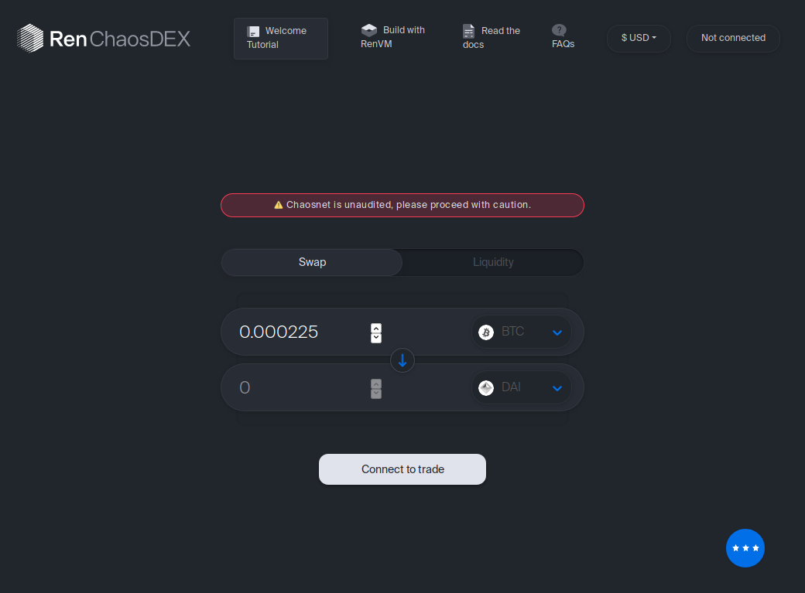

# RenVM Demo

A demo exchange built on top of RenVM.

It uses the [RenVM.js SDK](https://github.com/renproject/renvm-sdk-js). To get started using the SDK, read the [Developer Docs](https://docs.renproject.io/developers/) or the [Getting Started Tutorial](https://docs.renproject.io/developers/tutorial/getting-started).



## Run locally

This will run against `testnet`.

```sh
cd ethereum-contracts
yarn install
yarn run bindings:ts
```

```sh
cd react-client
yarn install
NETWORK="testnet" yarn start
```
